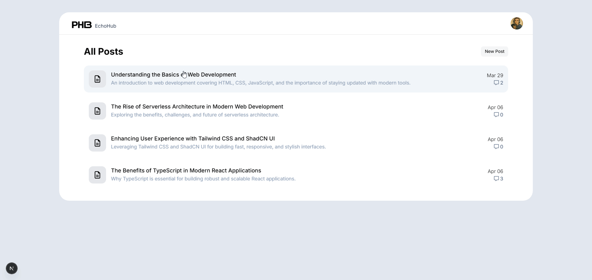

# Client Project Documentation

## Overview

This project is built using **Next.js 15**, a cutting-edge React framework that provides powerful new features for routing, data fetching, and server actions. It is a web post platform where users can create, edit, list, and delete posts and comments. The application supports two different APIs—**REST** and **GraphQL**—that can be switched using environment variables. It also uses **Server Actions** to communicate with the server efficiently.

The project is structured following **SOLID principles** to ensure maintainable, extensible, and testable code. Styling is achieved through **ShadCN and Tailwind CSS**, resulting in a clean, responsive, and highly customizable UI.

The design was generated using the AI-powered tool [**Galileo.ai**](https://www.usegalileo.ai/), providing a sleek and modern user interface.

### Application Preview

Below is a preview of the application in action, showcasing the seamless switching between REST and GraphQL APIs, as well as the responsive UI built with Tailwind CSS and ShadCN components.



---

## Features

- **Next.js 15 Compatibility:**  
  Built with the latest version of Next.js, providing enhanced features like app router, server components, and server actions.
- **Storybook Integration:**  
  Develop and test UI components in isolation with Storybook.  
  Storybook is configured and can be accessed using:

  ```bash
  npm run storybook
  ```

- **API Switching:**
  - Supports both REST and GraphQL APIs.
  - Toggle between APIs using environment variables.
- **CRUD Operations:**  
  Users can manage posts and comments through a clean UI.
- **Server Actions:**  
  The application uses Server Actions to communicate with the server, ensuring efficient data fetching and manipulation.
- **Responsive Design:**  
  Built using **Tailwind CSS** and **ShadCN UI components**, the application is fully responsive and optimized for various devices.
- **SOLID Principles:**  
  The architecture follows SOLID principles to enhance maintainability and scalability.

---

## Project Structure

- **`/public/`**: Holds static assets like images and fonts.
- **`/src/`**: The main source directory containing:
  - **`app/`**: Includes the main application components and pages.
  - **`components/`**: Reusable UI components used across the application.
  - **`lib/`**: Utility functions and libraries for various functionalities.
  - **`hooks/`**: Custom React hooks for state and logic management.
  - **`api/`**: API request and data fetching logic.
  - **`@types/`**: TypeScript type definitions and interfaces.
- **`/assets/`** (Only for README documentation):
  - **`/images/`**: Screenshots, diagrams, etc.
  - **`/gifs/`**: Animated demos and visual explanations.
  - **`/videos/`**: Demo videos or tutorials.

---

## Available Scripts

In the project directory, you can run:

- **`npm run dev`**: Starts the development server at `http://localhost:3000`.
- **`npm run build`**: Builds the application for production.
- **`npm run start`**: Runs the built application in production mode.
- **`npm run lint`**: Lints the codebase using ESLint to identify and fix issues.
- **`npm run storybook`**: Launches Storybook for isolated component development.
- **`npm run test`**: Runs tests using Vitest.

These scripts facilitate various development tasks, from running the application to testing and linting.

---

## Installation

Clone the repository and install dependencies:

```bash
git clone https://github.com/pleaobraga/api-communication.git
cd api-communication/client
npm install
npm start
```

---

## Environment Variables

An `env.example` file is provided in the repository. Copy and rename it to `.env` and adjust the variables as needed.

```env
# Define the API type: "rest" or "graphQL"
API_COMMUNICATION=rest

# REST API URL
REST_BASE_URL=http://localhost:3002

# GraphQL API URL
GRAPHQL_BASE_URL=http://localhost:3001
```

Changing `API_COMMUNICATION` will determine which API the client consumes.

---

## Further Improvements

- **Testing:** Add unit and integration tests.
- **Authentication:** Implement user authentication to secure endpoints.
- **User Registration:** Build a registration flow for new users.
- **Code Enhancements:** Improve error handling and optimize performance.

---
